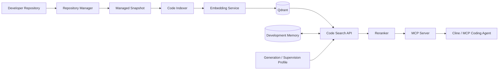

# Surfbots Code Intelligence

**Persistent code intelligence, development memory, and profile-driven
AI supervision for AI coding agents.**

Surfbots Code Intelligence gives coding agents a persistent
engineering-context layer beneath the chat session. It indexes the
repository you are actively developing, exposes bounded code evidence
through MCP, preserves useful engineering continuity, and connects to
the broader Surfbots Dev Platform for supervised development workflows.

The goal is simple: **stop making coding agents rediscover the same
repository on every task.**

> **Current release:** v0.4.0\
> **Deployment:** Local-first, self-hosted Kubernetes/k3d\
> **AI strategy:** Local Code Intelligence with profile-driven
> generation and supervision

[](https://opensource.org/licenses/Apache-2.0)
[](https://www.python.org/)
[](https://github.com/franknaw/surfbots-code-intelligence/releases)

------------------------------------------------------------------------

## Why It Exists

AI coding agents repeatedly spend context rediscovering repositories:
rereading files, relocating symbols, rebuilding architectural
understanding, and losing decisions between sessions.

Surfbots adds a persistent engineering layer underneath the coding
agent:

-   **Repository-aware Code Intelligence**
-   **Tree-sitter parsing and code-aware chunking**
-   **Qdrant semantic retrieval**
-   **Repository-scoped search**
-   **Symbol and reference discovery**
-   **Bounded file/context retrieval**
-   **Incremental indexing**
-   **Development Memory**
-   **MCP-native integration**
-   **Development Supervision**
-   **Profile-driven local or remote generation/supervision**
-   **Local Kubernetes lifecycle tooling**

  -----------------------------------------------------------------------
  Problem                             Surfbots approach
  ----------------------------------- -----------------------------------
  Context-window pressure             Retrieve focused evidence instead
                                      of repeatedly reading whole
                                      repositories

  Repository rediscovery              Maintain a persistent semantic
                                      index

  Weak continuity                     Preserve useful engineering context
                                      in Development Memory

  Broad retrieval                     Use bounded search, symbols,
                                      references, files, and line ranges

  Single-agent blind spots            Add structured supervision around
                                      substantial work

  Multiple repositories               Scope code, memory, and workflows
                                      by repository identity
  -----------------------------------------------------------------------

------------------------------------------------------------------------

# Code Intelligence

## Repository Registration and Isolation

Each repository receives a stable Surfbots identity. Indexing, search,
memory, and supervision are scoped by repository so multiple projects
can share the same platform without mixing their context.

``` bash
surfbots-dev repo add /path/to/repository
surfbots-dev repo list
```

## Managed Working-Tree Snapshot

The developer working tree remains canonical. Host tooling refreshes a
controlled snapshot for indexing rather than exposing arbitrary host
paths to Kubernetes.

``` text
Developer Working Tree
        ↓
Host Repository Manager
        ↓
Atomic Managed Snapshot
        ↓
Surfbots Indexer
```

## Incremental Indexing

Surfbots tracks file state and reindexes changed content rather than
rebuilding the entire repository unnecessarily.

The pipeline includes repository discovery, snapshot refresh, parsing,
chunking, embedding, Qdrant upsert, stale-record retirement, and
repository status updates.

## Tree-Sitter Parsing

Language-aware parsing provides useful code structures and metadata
rather than arbitrary text slices. Current indexing supports common
development formats including Python, JavaScript, TypeScript, Go, Rust,
Java, Shell, YAML, JSON, and Markdown.

## Semantic Retrieval

``` text
Developer Question
       ↓
Qwen3 Embedding
       ↓
Qdrant Code Index
       ↓
Repository / Path / Language Filtering
       ↓
Reranking / Bounded Retrieval
       ↓
Agent-Ready Evidence
```

### Current vector configuration

  Setting                Value
  ---------------------- -----------------------------------
  Collection             `code-index`
  Vector dimension       **1024**
  Distance               Cosine
  Embedding              Qwen3-Embedding-0.6B
  Reranking              BGE reranker
  Repository isolation   `repository_id` payload filtering

## Symbols, References, and Bounded Files

Surfbots lets agents narrow investigation before editing:

-   `find_symbol` --- locate definitions
-   `find_references` --- locate usages
-   `get_file` --- retrieve a file when necessary
-   `get_file_range` --- retrieve only the needed line range
-   `search_code` --- retrieve relevant semantic code evidence
-   `repository_status` --- confirm repository/index state

This is particularly useful for local models with finite context
windows.

------------------------------------------------------------------------

# Development Memory

Code tells the agent **what exists now**. Development Memory helps
explain **why it became that way**.

Surfbots can preserve concise engineering continuity such as decisions,
completed work, validation outcomes, unresolved items, task checkpoints,
refinement evidence, collaboration evidence, review evidence, and
workflow state.

Current repository code and tests remain authoritative when they
conflict with older memory.

## Supervision evidence types

The current supervision implementation uses semantically isolated memory
types:

-   `supervision_refinement`
-   `supervision_collaboration`
-   `supervision_review`
-   `checkpoint_workflow`

Supersession is same-type only. New evidence links to the canonical
prior Development Memory `memory_id`, preserving traceable history
without allowing one evidence type to overwrite another.

------------------------------------------------------------------------

# Development Supervision

Development Supervision adds structured refinement, checkpoints,
collaboration, review, provenance, and fail-closed completion around
substantial coding work.

It does **not** replace the primary coding agent.


### Supervision capabilities

-   **Task refinement** --- converts a substantial request into a
    repository-aware implementation specification.
-   **Phase checkpoints** --- invoke the configured supervision profile
    at meaningful development boundaries.
-   **Collaboration** --- adds another engineering perspective for
    architecture decisions, blockers, conflicts, and tradeoffs.
-   **Change review** --- checks completed work against the
    specification, repository evidence, architecture, and supplied
    tests.
-   **Status and provenance** --- reports workflow state, model/provider
    provenance, and supervision usage.
-   **Completion integrity** --- verifies persisted refinement,
    checkpoints, review evidence, and final verdict before permitting
    completion.

The canonical successful review verdict is:

``` text
no_issues_found
```

------------------------------------------------------------------------

# Profile-Driven AI

Surfbots is **not tied to one generation or supervision model**.

Generation and supervision are selected through profiles. A profile can
use:

-   a lightweight local model
-   a larger local model
-   an approved remote provider such as OpenAI
-   another supported OpenAI-compatible endpoint

This keeps the repository-intelligence layer independent from the
generation-provider decision.

## Practical local footprint

The baseline local burden is primarily:

-   Kubernetes/k3d services
-   Qdrant
-   repository indexing
-   Qwen3 embeddings
-   BGE reranking
-   Development Memory
-   MCP services

A large local generation/supervision LLM is not required when the active
profile uses a remote provider.

  -----------------------------------------------------------------------
  Resource                             Baseline               Recommended
  ------------------- ------------------------- -------------------------
  CPU                     4 modern 64-bit cores                  8+ cores

  RAM                                     16 GB                     32 GB

  SSD free space         \~25 GB starting point            More for large
                                                      repositories/images

  Discrete GPU                     Not required   Useful for larger local
                                                             LLM profiles
  -----------------------------------------------------------------------

If generation/supervision run locally, their model size and context
settings can require additional RAM or GPU resources.

------------------------------------------------------------------------

# MCP Integration

Surfbots exposes Code Intelligence, Development Memory, and Development
Supervision through MCP.

Representative current tools include:

  Capability                     Tool
  ------------------------------ ----------------------------------
  Semantic code retrieval        `search_code`
  File retrieval                 `get_file`
  Bounded file retrieval         `get_file_range`
  Symbol discovery               `find_symbol`
  Reference discovery            `find_references`
  Repository/index state         `repository_status`
  Recent engineering context     `get_recent_context`
  Historical repository memory   `search_repository_memory`
  Persist engineering context    `write_repository_memory`
  Task refinement                `refine_task`
  Active collaboration           `collaborate_task`
  Phase supervision              `development_task_checkpoint`
  Change review                  `review_changes`
  Supervision status/usage       `development_supervision_status`
  Fail-closed completion         `complete_development_task`

> The installed platform's MCP `tools/list` response is the runtime
> source of truth for tool availability.

------------------------------------------------------------------------

# Architecture



The broader Surfbots Dev Platform includes seven core workloads: Code
Indexer, Code Search API, MCP Server, Embedding Model Service,
Generation Model Service, Reranker Model Service, and Qdrant.

------------------------------------------------------------------------

# Relationship to Surfbots Dev Platform

**Surfbots Code Intelligence** is the repository-awareness foundation.

**Surfbots Dev Platform** builds on it with Development Memory,
Development Supervision, model/provider profiles, MCP integration,
persistent local services, and lifecycle management.

``` text
Surfbots Dev Platform
├── Code Intelligence
│   ├── repository indexing
│   ├── semantic retrieval
│   ├── symbol/reference discovery
│   └── bounded file context
├── Development Memory
├── Development Supervision
├── MCP Server
├── Embedding / Reranking
├── Generation / Supervision Profiles
├── Qdrant
└── Kubernetes Lifecycle Tooling
```

This repository serves as the public/distribution entry point for the
packaged platform; it is not intended to mirror every development-source
file.

------------------------------------------------------------------------

# Local-First and Private Operation

The Code Intelligence path can remain local:

-   repository source stays under developer control
-   managed snapshots remain local
-   embeddings and reranking can run locally
-   Qdrant runs locally
-   Development Memory can remain local
-   MCP runs locally

Generation and supervision can also remain local, or they can use an
approved remote provider while repository indexing and retrieval stay on
the developer's infrastructure.

------------------------------------------------------------------------

# Installation

## Prerequisites

Current local deployment targets Linux and expects:

-   Docker
-   kubectl
-   k3d
-   Helm
-   Git
-   rsync
-   curl
-   Python 3

## Bootstrap

Download and inspect the bootstrap before running it:

``` bash
curl -fsSL \
  https://raw.githubusercontent.com/franknaw/surfbots-code-intelligence/main/bootstrap.sh \
  -o /tmp/surfbots-bootstrap.sh

less /tmp/surfbots-bootstrap.sh
bash /tmp/surfbots-bootstrap.sh
```

Use the release/version/profile options published by the actual packaged
release rather than copying arguments from an older README.

------------------------------------------------------------------------

# Typical Workflow

``` bash
# Start and verify
surfbots-admin start
surfbots-admin status

# Register the repository
cd /path/to/your/repository
surfbots-dev repo add .

# Verify repository/index state
surfbots-dev status
```

Then connect an MCP-capable coding agent to the installed Surfbots MCP
endpoint and use Code Intelligence, Development Memory, and Development
Supervision as needed.

For substantial tasks:

``` text
refine_task
→ post_investigation
→ implementation
→ post_implementation
→ tests
→ post_test
→ pre_review
→ review_changes
→ development_supervision_status
→ complete_development_task
```

------------------------------------------------------------------------

# Lifecycle and Persistence

The packaged platform provides supported lifecycle tooling:

``` bash
surfbots-admin start
surfbots-admin stop
surfbots-admin status
```

The platform is designed so intended persistent state can survive
supported stop/start operations, including Qdrant indexes, repository
metadata, Development Memory, supervision evidence, and workflow state.

The development lifecycle also supports immutable image builds, service
redeployment, recorded-image reuse, missing-image self-healing, and
managed systemd port forwards.

------------------------------------------------------------------------

# Configuration

  Role                      Current baseline
  ------------------------- ----------------------
  Embedding                 Qwen3-Embedding-0.6B
  Vector dimension          **1024**
  Reranking                 BGE reranker
  Generation                Profile-selected
  Development Supervision   Profile-selected

Changing the generation/supervision profile does not require replacing
the Code Intelligence index.

------------------------------------------------------------------------

# Troubleshooting

## MCP unavailable

``` bash
surfbots-admin status
```

Verify the MCP workload and managed port-forward. Avoid starting
duplicate manual `kubectl port-forward` processes when the managed
systemd forward is active.

## Code Search API unavailable

``` bash
kubectl get pods -n surfbots-dev-platform
kubectl logs -n surfbots-dev-platform -l app=code-search-api
```

## Qdrant unavailable

``` bash
kubectl get pods -n surfbots-dev-platform | grep qdrant
```

## Stale results

Verify repository status and refresh/reindex the managed snapshot using
the supported CLI workflow.

## Context-window pressure

Prefer bounded retrieval:

-   `search_code`
-   `find_symbol`
-   `find_references`
-   `get_file_range`

Avoid repeatedly loading the same skill, logs, or whole files. Compact
long agent sessions before they approach the model's hard context limit.

## Supervision completion rejected

Use `development_supervision_status` to identify missing refinement,
checkpoints, review evidence, or final verdict instead of manually
altering completion flags.

------------------------------------------------------------------------

# Release Information

**Current documented release: v0.4.0**

This README replaces stale v0.2.0/v0.3.0 content and removes unresolved
Git merge-conflict markers.

Before publishing a GitHub Release, keep these values synchronized:

-   `VERSION`
-   README version badge
-   Git tag
-   release manifest
-   bootstrap default version
-   packaged artifact version

If the distribution repository's `VERSION` file has not yet been
updated, set it to:

``` text
0.4.0
```

before tagging/publishing v0.4.0.

------------------------------------------------------------------------

# Status

Current platform capabilities include:

-   repository registration and isolation
-   managed snapshots
-   incremental indexing
-   Tree-sitter code parsing
-   1024-dimensional semantic retrieval
-   Qdrant vector storage
-   reranking
-   symbols and references
-   bounded file retrieval
-   Development Memory
-   MCP integration
-   Development Supervision
-   phase checkpoints
-   review and completion integrity
-   model/provider profiles
-   local Kubernetes lifecycle
-   persistent engineering context

------------------------------------------------------------------------

## License

Apache 2.0. See the repository license for details.

## Repository

[franknaw/surfbots-code-intelligence](https://github.com/franknaw/surfbots-code-intelligence)
